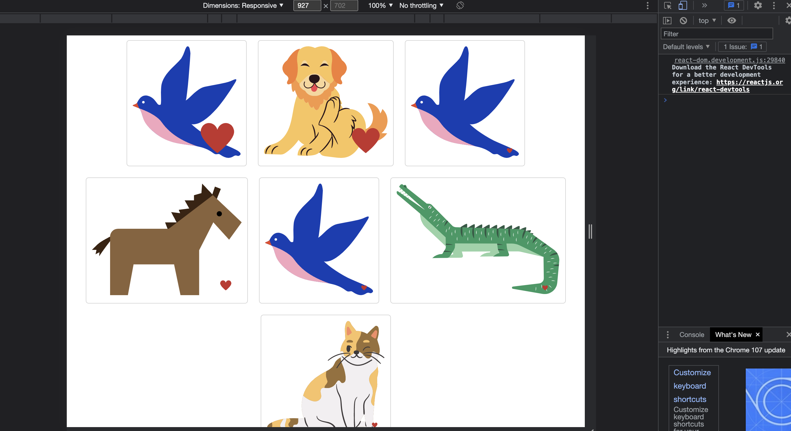

# Animal Cards (Udemy Project)

### useState

- if you want to change what the user sees on screen as a reaction to an event, use state

### list building in react
- map take every element out of an array and pass it to a function 

```js
const renderAnimals = animals.map((animal, index) => {
        return <AnimalShow type={animal} key={index}/>
  })
  
```


